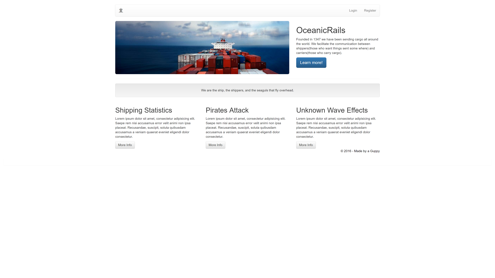

# OceanicRails

    

## Utilizes

* bootstrap
* font-awesome

Shipped, login, logout

## User: Model
* fname
* lname
* email
* password

## Boats: Model
* name
* Number of containers it can carry ccc (caontainer carry count)
* Current Location

## Jobs: Model
* Description about the job
* Origin (start point of job)
* Destination (ending point of job)
* cost
* Containers count to be shipped

## linking Table
Think follow, following.
What jobs is a boat signed up for?
What boats are asigned to some job?

Boats show page assign to jobs.

Jobs show page show what boats are assigned to it.

## Relationships

Boats -> user (the user it belongs to)

Boats -< jobs (A boat can have many jobs)
Jobs -< boats (A job can have many boats assigned to it (to split the order))

rails generate model Assignment boat_id:integer job_id:integer

Jobs page where you assign what boats to work on it

the keys are alive with the sound of keeeeeying
